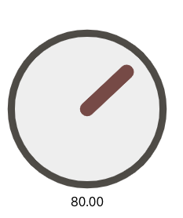

# React Canvas Rotary Knob
- Fully customizable Rotary Knob
- Powered with HTML Canvas

  

## WebDemo
[Live Web Demo](https://react-canvas-rotary-knob-timsusa.vercel.app) 

## Get Started

This project consists of one testing application and one build for the lib. Consider the .tsx file can be used in the deno world, aswell. However, in the project directory, you can run:

### 
  isDisabled = false,
  width: tWidth = 160,
  height: tHeight = 160,
  value = 80,
  max = 127,
  min = 0,
  backgroundColor = "#ccc",
  cbValChanged = (val: number) => val,
  color = "#37332ee0",
  showValueLabel = true,
  debounceDelay = 5,
  lineWidth = 40,

### Local Test Application
### `yarn start`

Runs the wrapper app in the development mode.\
Open [http://localhost:3000](http://localhost:3000) to view it in the browser.

The page will reload if you make edits.\
You will also see any lint errors in the console.

### `yarn test`

Launches the test runner in the interactive watch mode.\
See the section about [running tests](https://facebook.github.io/create-react-app/docs/running-tests) for more information.

### `yarn build`

Builds the app for production to the `build` folder.\
It correctly bundles React in production mode and optimizes the build for the best performance.

The build is minified and the filenames include the hashes.\
Your app is ready to be deployed!

See the section about [deployment](https://facebook.github.io/create-react-app/docs/deployment) for more information.

### Deployment

This section has moved here: [https://facebook.github.io/create-react-app/docs/deployment](https://facebook.github.io/create-react-app/docs/deployment)
